# Opengl


## 环境配置与搭建

### git管理代码

https://blog.csdn.net/shulianghan/article/details/114926281

https://greambwang.blog.csdn.net/article/details/118345307?spm=1001.2101.3001.6650.5&utm_medium=distribute.pc_relevant.none-task-blog-2%7Edefault%7EBlogCommendFromBaidu%7ERate-5-118345307-blog-114926281.pc_relevant_multi_platform_featuressortv2dupreplace&depth_1-utm_source=distribute.pc_relevant.none-task-blog-2%7Edefault%7EBlogCommendFromBaidu%7ERate-5-118345307-blog-114926281.pc_relevant_multi_platform_featuressortv2dupreplace&utm_relevant_index=6

### ctrl+shift+space

### 创建一个空项目取名OpenGL

1.点击这个然后创建一个文件夹取名src


2.新建一个cpp程序

3.打开这个文件夹的地址，找到sln文件所在的地方即解决方案所在地方创建一个Dependencies文件夹，用来放各种库


### 现在文件夹里有各种库了，需要去vs2019链接他们，记住所有配置和win32

简单的来说就是把GLFW和GLEW里的头文件以及lib静态库放进denpendencies文件夹里以及include他们、链接他们，并指明lib的名字


### 下载GLFW、GLEW（或者直接用我的dependencies，里面已经包含好了，只需要你在VS2019里设置一些其他的东西即可）（#include <GL/glew.h>
#include <GLFW/glfw3.h>）先后顺序不能错，这是源代码决定的）

如果你想用GLAD，配置也是差不多的

https://www.glfw.org/download.html下载，32位的windows二进制文件（下载64位或者32位取决于你编译的时候是x64还是x86），也可以下载源码自己编译。


下载之后将这两个文件复制粘贴至


### glad如何配置

进入https://glad.dav1d.de/，选择版本等等

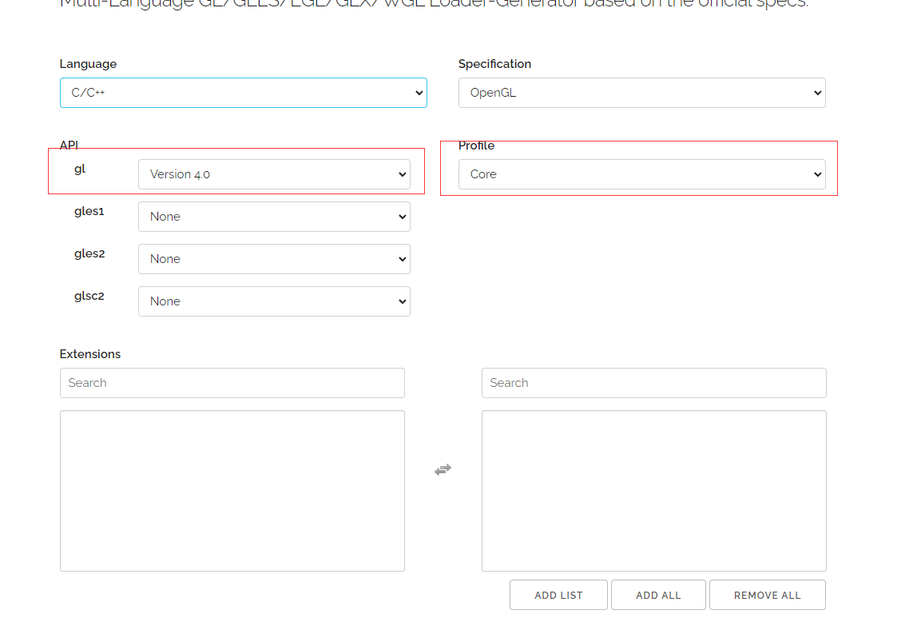

然后生成，下载glad.zip

GLAD现在应该提供给你了一个zip压缩文件，包含两个头文件目录，和一个**glad.c**文件。将两个头文件目录（**glad**和**KHR**）复制到你的**Include**文件夹中（或者增加一个额外的项目指向这些目录），并添加**glad.c**文件到你的工程中。

简单来说就是把头文件放进包含目录，lib文件要加一个库目录，并且链接器也要增加glfw3.lib以及opengl32.lib,

tips:

khr可以与glad放在一起

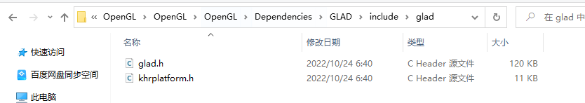

也可以不必

## 第二次学习的学习过程

### 第一步创建上下文

首先初始化等等，创建一个上下文

### GLAD

GLAD是用来管理OpenGL的函数指针的，可以利用这个库去找OpenGL的函数

### 特别记住GLAD需要置于在其它依赖于OpenGL的头文件（如GLFW）之前

### 你好，窗口

```C++
#include <glad/glad.h>
#include <glfw/glfw3.h>
#include <iostream>


void framebuffer_size_callback(GLFWwindow* window, int width, int height)
{
	glViewport(0, 0, width, height);
}

void processInput(GLFWwindow* window)
{
	if (glfwGetKey(window, GLFW_KEY_ESCAPE) == GLFW_PRESS)
	{
		glfwSetWindowShouldClose(window, true);
	}
}


int main()
{
	glfwInit();//确定版本，并进行初始化
	glfwWindowHint(GLFW_CONTEXT_VERSION_MAJOR, 3);
	glfwWindowHint(GLFW_CONTEXT_VERSION_MINOR, 3);
	glfwWindowHint(GLFW_OPENGL_PROFILE, GLFW_OPENGL_CORE_PROFILE);
	//glfwWindowHint(GLFW_OPENGL_FORWARD_COMPAT, GL_TRUE);

	GLFWwindow* window = glfwCreateWindow(800, 600, "LearnOpenGL", NULL, NULL);//创建了一个可供渲染的窗口，后两个参数暂时用不到，可以不用
	if (window == NULL)
	{
		std::cout << "Create window failed" << std::endl;
		glfwTerminate();
		return -1;
	}
	glfwMakeContextCurrent(window);//设置为主要上下文窗口

	//初始化GLAD
	if (!gladLoadGLLoader((GLADloadproc)glfwGetProcAddress))
	{
		std::cout << "Failed to initialize GLAD" << std::endl;
		return -1;
	}

	//视口，渲染窗口的尺寸大小
	glViewport(0, 0, 800, 600);//我们也可以不用挤满，这样的话就可以放置一些其他东西在窗口里了

	//然而，当用户改变窗口的大小的时候，视口也应该被调整。我们可以对窗口注册一个回调函数(Callback Function)，它会在每次窗口大小被调整的时候被调用。这个回调函数的原型如下：

	glfwSetFramebufferSizeCallback(window, framebuffer_size_callback);

	//下面几行的代码就实现了一个简单的渲染循环：
	while (!glfwWindowShouldClose(window))
	{
		//输入
		processInput(window);//检查是否按了esc，没有按就不会把window设置为需要关闭
		//渲染指令
		glClearColor(0.2f, 0.3f, 0.3f, 1.0f);
		glClear(GL_COLOR_BUFFER_BIT);

		//检查并调用事件，交换缓冲
		glfwSwapBuffers(window);
		glfwPollEvents();
	}

	glfwTerminate();//相当于释放所有资源

	return 0;
}
```

### 你好三角形

首先记住三个关键词

1. 顶点数组对象：Vertex Array Object，VAO
2. 顶点缓冲对象：Vertex Buffer Object，VBO
3. 元素缓冲对象：Index Buffer Object，IBO

在OpenGL中大部分工作都是关于把3D坐标转变为适应屏幕的2D像素，3D转为2D的处理过程是由OpenGL的图形渲染管线管理的

#### 着色器

图形渲染管线很容易并行执行，现在GPU都有成千上万个小处理核心，它们在GPU上为每一个渲染管线运行各自的小程序，从而快速渲染你的数据，这些小程序叫做着色器。

OpenGL着色器是用OpenGL着色器语言(OpenGL Shading Language, GLSL)写成的

1. 顶点着色器（告诉GPU顶点）

2. 图元装配（告诉基本单元，是点还是三角形）

3. 几何着色器（得到是点，那么就可以把所有基本数据生成几何形状）

4. 光栅化阶段（光栅化阶段，生成像素点）

5. 片段着色器（片段是渲染一个像素的所有数据，也就是呈现的颜色，需要计算很多东西，光照、阴影、颜色等等）

   主要而言，我们必须定义一个顶点着色器和片段着色器（因为GPU没有）

#### 顶点输入

首先，输入的是一个相对位置，我们在CPU上创建了点后需要与VBO顶点缓冲对象进行绑定，VBO管理这个内存，它会在显存里存储大量顶点。好处就是可以发送一大批数据，CPU与GPU连接较慢，发送到了显存，那么顶点着色器就可以立即访问顶点

步骤

1. 创建一个顶点缓冲对象VBO，绑定
2. 绑定数组
3. 告诉GPU数组的分布

#### 顶点着色器

1. 编辑一个GLSL的代码
2. 创建一个无符号的顶点着色器ID，将其绑上
3. 整合一下

#### 片段着色器

与上诉同理

#### 最后需要把多个着色器合并之后并链接最终的版本

1. 编辑一个着色器项目
2. 将两个着色器绑住
3. 链接到一起，得到一个程序对象
4. 激活程序对象

#### 在着色器对象连接到程序对象后记得删除着色器对象，不再需要了

#### 我们已经把数据发送给了GPU，但是GPU还不知道怎么理解内存中的顶点数据

我们已经在顶点着色器里的0位置创建了一个顶点向量，相当于现在把数据放进去，然后启用顶点属性

代码

```C++
	//顶点输入
	float vertices[] = {
	-0.5f, -0.5f, 0.0f,
	 0.5f, -0.5f, 0.0f,
	 0.0f,  0.5f, 0.0f
	};

	//顶点缓冲对象
	unsigned int VBO;
	glGenBuffers(1, &VBO);//意思就是把1绑定在VBO上了，缓冲ID为1，是独一无二的
	//绑定数组
	glBindBuffer(GL_ARRAY_BUFFER, VBO);
	//确定数组的数据以及位置
	glBufferData(GL_ARRAY_BUFFER, sizeof(vertices), vertices, GL_STATIC_DRAW);

	//着色器的创建
	const char* vertexShaderResource = "#version 330 core\n"
		"layout(location = 0) in vec3 apos;\n"
		"void main()\n"
		"{\n"
		"gl_Position = vec4(apos.x, apos.y, apos.z, 1.0);\n"
		"}\0";
	unsigned int vertexShader;
	vertexShader = glCreateShader(GL_VERTEX_SHADER);
	glShaderSource(vertexShader, 1, &vertexShaderResource, NULL);
	glCompileShader(vertexShader);

	//片段着色器的创建
	const char* fragmentShaderResource = "#version 330 core\n"
		"out vec4 FragColor;\n"
		"void main()\n"
		"{\n"
		"FragColor = vec4(1.0f, 0.5f, 0.2f, 1.0);\n"
		"}\0";

	unsigned int fragmentShader;
	fragmentShader = glCreateShader(GL_FRAGMENT_SHADER);
	glShaderSource(fragmentShader, 1, &fragmentShaderResource, NULL);
	glCompileShader(fragmentShader);
	//创建着色器程序
	unsigned int shaderProgram;
	shaderProgram = glCreateProgram();
	glAttachShader(shaderProgram, vertexShader);
	glAttachShader(shaderProgram, fragmentShader);
	glLinkProgram(shaderProgram);

	//删除着色器
	glDeleteShader(vertexShader);
	glDeleteShader(fragmentShader);
	//告诉GPU数据的形式
	glVertexAttribPointer(0, 3, GL_FLOAT, GL_FALSE, 3*sizeof(GL_FLOAT), (void*)0);
	//启用0号顶点属性
	glEnableVertexAttribArray(0);
	//启用着色器
	glUseProgram(shaderProgram);
```

## 顶点数组对象（VAO）

但是每一次绘图感觉都要经历这么多操作，感觉很麻烦，创建很多歌VAO换着绑定就可以了

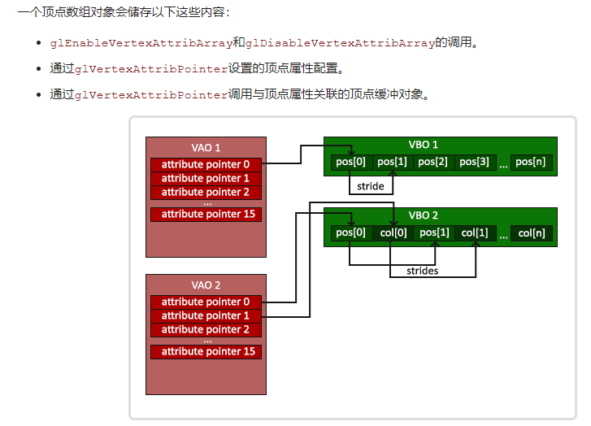

```C++
//顶点输入
float vertices[] = {
-0.5f, -0.5f, 0.0f,
 0.5f, -0.5f, 0.0f,
 0.0f,  0.5f, 0.0f
};
//顶点缓冲对象
unsigned int VBO;
glGenBuffers(1, &VBO);//意思就是把1绑定在VBO上了，缓冲ID为1，是独一无二的
//顶点数组对象
unsigned int VAO;
glGenVertexArrays(1, &VAO);//意思就是把1绑定在VBO上了，缓冲ID为1，是独一无二的
//绑定顶点数组
glBindVertexArray(VAO);
//确定数组的数据以及位置
glBindBuffer(GL_ARRAY_BUFFER, VBO);
glBufferData(GL_ARRAY_BUFFER, sizeof(vertices), vertices, GL_STATIC_DRAW);

//着色器的创建
const char* vertexShaderSource = "#version 330 core\n"
	"layout (location = 0) in vec3 aPos;\n"
	"void main()\n"
	"{\n"
	"   gl_Position = vec4(aPos.x, aPos.y, aPos.z, 1.0);\n"
	"}\0";
unsigned int vertexShader;
vertexShader = glCreateShader(GL_VERTEX_SHADER);
glShaderSource(vertexShader, 1, &vertexShaderSource, NULL);
glCompileShader(vertexShader);

//片段着色器的创建
const char* fragmentShaderSource = "#version 330 core\n"
	"out vec4 FragColor;\n"
	"void main()\n"
	"{\n"
	"    FragColor = vec4(1.0f, 0.5f, 0.2f, 1.0);\n"
	"}\0";

unsigned int fragmentShader;
fragmentShader = glCreateShader(GL_FRAGMENT_SHADER);
glShaderSource(fragmentShader, 1, &fragmentShaderSource, NULL);
glCompileShader(fragmentShader);
//创建着色器程序
unsigned int shaderProgram;
shaderProgram = glCreateProgram();
glAttachShader(shaderProgram, vertexShader);
glAttachShader(shaderProgram, fragmentShader);
glLinkProgram(shaderProgram);

//删除着色器
glDeleteShader(vertexShader);
glDeleteShader(fragmentShader);
//告诉GPU数据的形式
glVertexAttribPointer(0, 3, GL_FLOAT, GL_FALSE, 3*sizeof(GL_FLOAT), (void*)0);
//启用0号顶点属性
glEnableVertexAttribArray(0);

//下面几行的代码就实现了一个简单的渲染循环：
while (!glfwWindowShouldClose(window))
{
	//输入
	processInput(window);//检查是否按了esc，没有按就不会把window设置为需要关闭
	//启用着色器
	glUseProgram(shaderProgram);
	//绑定顶点数组
	glBindVertexArray(VAO);
	glDrawArrays(GL_TRIANGLES, 0, 3);

	////渲染指令
	//glClearColor(0.2f, 0.3f, 0.3f, 1.0f);
	//glClear(GL_COLOR_BUFFER_BIT);

	//检查并调用事件，交换缓冲
	glfwSwapBuffers(window);
	glfwPollEvents();
}
```

## 索引缓冲对象

glDrawElements函数从当前绑定到GL_ELEMENT_ARRAY_BUFFER目标的EBO中获取其索引。这意味着我们每次想要使用索引渲染对象时都必须绑定相应的EBO

碰巧顶点数组对象也跟踪元素缓冲区对象绑定

//记住：当VAO处于活动状态时，不要解除绑定EBO，因为绑定元素缓冲区对象存储在VAO中；保持EBO的约束。

## 所有流程

1. 提前写好着色器、顶点数组、索引数组
2. 创建VBO、VAO、EBO
3. 告诉GPU怎么取

## VAO、VBO、EBO的创建顺序和解绑顺序

创建顺序

vao-vbo-ebo

解绑顺序

vao-vbo-ebo

### 需要每次绘制完后都解绑VAO,VBO吗?

修改其他VAO都需要调用glBindVertexArray，它会直接解绑旧的对象并且绑定一个新的，因此通常情况下，我们不需要通过调用glBindVertexArray(O)来解绑VAO，当然VBO也是这样。所以在使用中，无需过度在意是否解绑了VAO和VBO，通常是不需要解绑的。

## Uniform

1. 在着色器里声明uniform
2. 通过glGetUniformLocation查询"ourColor"在哪
3. 再通过glUniform4f设置Uniform的值
4. ps一定要记得使用了glUseProgram(shaderProgram)才能设置值，因为它是在当前激活的着色器程序中设置uniform的。

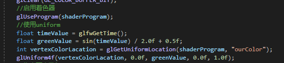

## 把颜色数据放进顶点数据中

1. 重新告诉GPU定点数据的分布，位置放在Location1,颜色放在location2
2. 着色器里取数据
3. 开画

我们只指定了三个顶点的颜色，但光栅化会对这些进行一种线性插值

## 重点，自己抽象着色器类

1. 首先我们要知道这个着色器到底要实现什么功能
2. 无非就是读取txt文件，然后创建着色器，把数据放进去，两个着色器绑定，最后删除着色器
3. 开画

## 一些坑

### 在glewInit()之前记得先创建一个初始化的Opengl上下文窗口

### 记得提前定义一个glew32static的宏，不然会去找动态文件

### 顶点缓冲区

顶点缓冲区就是一个内存缓冲区，内存字节数组，就是一块用来存字节的内存，存字节的，但顶点缓冲区和C++中像字符数组的内存缓冲区不一样，它是在我们的GPU也就是VRAM，Video RAM中，意思就是我要定义一些数据来表示三角形，然后将其放入显卡的RVAM中，然后还需要发出DrawCall指令

我们其实是在CPU上写东西

### 着色器

着色器是一个运行在显卡上的程序，它是我们可以编写的，可以在GPU上运行的代码

Opengl是一个状态机，也就是说你不需要把它看成对象或类似的东西，你所做的是设置一系列的状态

着色器分为顶点着色器和片段着色器（像素着色器），细分着色器，几何体着色器

### opengl的管线或者说图像渲染管线的标准，或者粗略的说是如何工作的

在你头脑里面你应该有一幅画面，就是我们在cpu上写了一大堆数据，我们把数据发给了gpu，我们发出了一个调用，在你开始调用之前我们绑定了一些状态。最后，我们进入了着色阶段，或者更确切的说，gpu开始实际处理调用并在屏幕上绘制一些东西，然后我们再屏幕上得到了三角形，这个具体的过程实际上就是渲染管线

那么我们如何从有数据到屏幕上有结果呢？

现在，着色器就派上用场了，当gpu开始绘制三角形时，顶点着色器和片段着色器是两种沿着管线不同类型的着色器，所以当我们发出一个绘制调用，顶点着色器、片段着色器会获得调用。

所以每个顶点都会调用一次顶点着色器

一个顶点着色器重要的目的就是提供给那些顶点位置，我们需要能够给他们提供转换，这样opengl可以将这些数字转换成屏幕上的坐标

### docs.gl最好的gl网站

### 索引缓冲区

目的是摆脱数据的冗余效果，因为画一个正方形只需要四个点而不是六个点

任何索引的缓冲都必须由无符号的整数组成，不是有符号的，是没符号的

### 检查错误的方法


得到错误为1280,去glew.h文件里搜寻1280，注意1280要转换为16进制才能搜索


简单的转换办法就是在该函数右边加入一个断点进行调试，然后把鼠标放置error就可以获得错误


### 但实际上上述的方法我们还需要在每个函数上进行放置，并且需要自己手动设置断点

### 在遇到错误代码时自动设置断点

 需要定义一个宏


### 不用写更多的代码直接利用一个宏来找问题出在哪里


### 最后想把发生错误的函数名称、函数来自于哪个代码文件，函数代码行数


### uniform 

可以在c++里设置图像的像素


### 使用uniform可以使像素点根据时间发生变化

### glfwSwapInterval(1);//设置帧率使其垂直同步

### 创建顶点数组缓冲区之后


创建顶点数组缓冲区之后

我们不需要执行enableVertexAttribPointer代码以及 glVertexAttribPointer，删除即可


ps.当我们绑定顶点数组和缓冲区的时候，实际上没有东西去连接这两个东西


但当我们实际上指定这个glVertexAttribPointer的时候，我们说的是这个顶点数组的索引为零的位置，将实际绑定到当前绑定的GL_ARRAY_BUFFER插槽里


所以上面这一行代码就是两者之间的连接器

### 所以你可以在整个项目里有一个全局的VAO，然后每次绑定不同的缓冲区和不同的顶点规范，或者你对每个几何体或唯一几何体或任何东西都有单独的VAO。

### 在把顶点缓冲区与索引缓冲区都做成头文件分类之后会出现一个问题

那就是由于IndexBuffer的析构函数会在作用域内消散后解绑，但是由于在主函数里面，在主函数会调用一个glfwTerminate();这样gl就初始化了，没有上下文了，那么这个析构函数就会出问题，没法解绑，导致问题的出现

但是没关系，因为一般不会把这个写在主函数里面，如果想改变的话，就让glfwTerminate的代码放在作用域外面


### 顶点数组的抽象

https://blog.csdn.net/danshiming/article/details/56286880?spm=1001.2101.3001.6661.1&utm_medium=distribute.pc_relevant_t0.none-task-blog-2%7Edefault%7ECTRLIST%7ERate-1-56286880-blog-96433508.pc_relevant_multi_platform_whitelistv3&depth_1-utm_source=distribute.pc_relevant_t0.none-task-blog-2%7Edefault%7ECTRLIST%7ERate-1-56286880-blog-96433508.pc_relevant_multi_platform_whitelistv3&utm_relevant_index=1

这篇文章讲的很好

顶点数组的抽象，在我们创建一个顶点数组时，希望与顶点缓冲区里的数据进行绑定，并且绑定功能与解绑功能。

所以需要一个

```c++
1.AddBuffer(const VertexBuffer& vb, const VertexBufferLayout& layout);
```

```c++
2.void Bind() const;
```

```c++
3.void Unbind() const;
```

```c++
AddBuffer(const VertexBuffer& vb, const VertexBufferLayout& layout);
```

addbuffer的关键在于

```c++
glEnableVertexAttribArray(0);//
glVertexAttribPointer(0, 2, GL_FLOAT, GL_FALSE, sizeof(float) * 2, 0);//设置顶点缓冲区的布局
```

### layout

https://www.5axxw.com/questions/content/trsq4r，layout的解释，怎么个告诉GPU你的东西

### 抽象着色器

抽象着色器最主要的就是需要抽象什么， 首先应该可能是一些统一变量的东西，好让我们在CPU里进行改变，所以我们要对颜色设置一个统一变量，还有就是片段着色器、顶点着色器的文本，第二步就是绑定以及解绑着色器，第三步就是我们能在着色器上设置各种不同的统一变量

### 头文件重复包含问题，将其放入CPP文件里

## 加载纹理

加载png，会返回给我们一个指向RGB,A像素缓冲区的指针，然后我们会取那个像素组，然后把它上传到我们的显卡，我们使用OpenGL然后把数据作为纹理发送到显卡，然后在绘制时我们就可以修改着色器来读取那个纹理，所以，像素着色器，也就是片段着色器会从纹理内存中读取

并实际计算出每个像素应该是什么，构成那个纹理每部分的颜色是什么

那就是当我们绘制出矩形的时候会发生的事情

1.载入图像，在OpenGL中创建纹理

2.然后，当渲染的时候，我们必须绑定纹理

3.我们修改我们的着色器来绑定到那个纹理插槽，那就是我们要绑定我们纹理的地方

4.我们也在着色器中对这个纹理采样

### 安装stb_image

https://raw.githubusercontent.com/nothings/stb/master/stb_image.h进入复制

创建一个vendor文件夹里的stb_image，使用第三库的原因

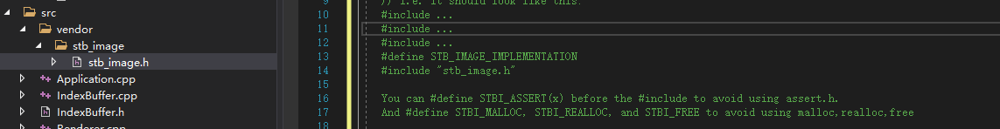

根据头文件编译

### 纹理如何安放

纹理相当于一种贴图的感觉，纹理也需要纹理坐标

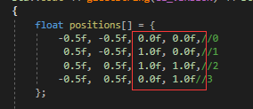

图里红框框就是纹理坐标，我们需要加载到GPU里，然后我们再加载一张图片，纹理坐标会根据图片进行采样，当然很明显有个问题就是，图片和我们要映射的区域很容易有差别，像素点也会有差别

比如我们的区域一个像素点刚好对应图片里四个像素点，是选择平均还是啥呢，选法不同，图片的效果也不一样。

纹理数据在Shader里的处理

这个**布局**需要格外注意一下，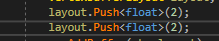

layout了两批数据，都是二维二维的，第一批为坐标，第二批为纹理坐标

m_elements结构体里有两组数据

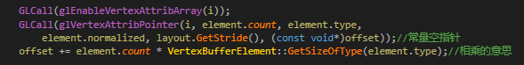

这两组数据是供glVertexAttribPointer使用的，很明显第一组坐标为0这个0要与shader里的location对应，第二组为1，

第一组的参数我说一下

glVertexAttribPointer(0, 2, GL_FLOAT, GL_FALSE, 4个字节, (const void*)0));//常量空指针

第二组的参数

glVertexAttribPointer(1, 2, GL_FLOAT, GL_FALSE, 4个字节, (const void*)2));

第二组相对于起始位置有2个偏移量

然后我们去Basic.shader里看，location与之对应，这样我们才取得到数据，

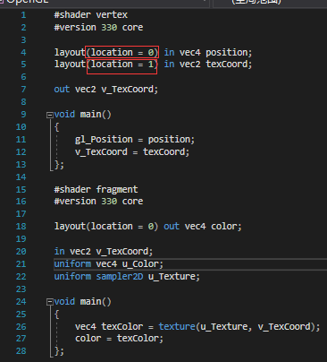

## Opengl的数学库

https://github.com/g-truc/glm

复制粘贴到这个目录下


将该文件移除

因为里面也含有一个main()函数，这样我们就没法编译了

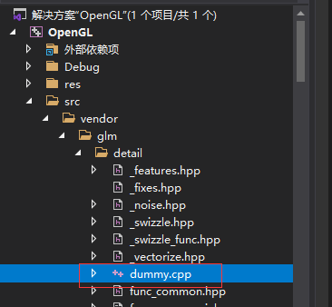

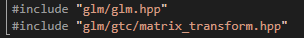


### 投影矩阵

一个正交投影矩阵的示范：

顶点矩阵

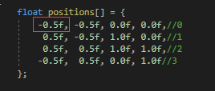

投影矩阵

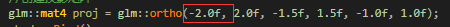

由于-0.5f是-2.0f的四分之一，所以会在整个屏幕的四分之一处，也就是所在窗口的四分之一处

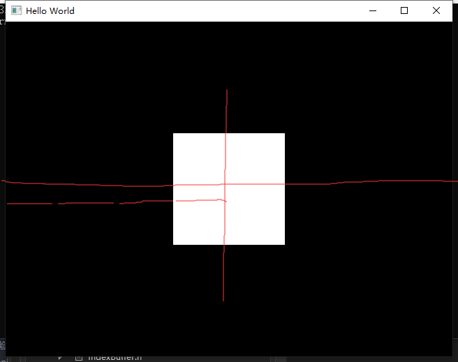

# VA(visual assist番茄助手的安装)

## 安装番茄助手（安装之前关闭VS2019)

## 复制CRACK里的VA_X.dll进入文件夹里


# 完整代码

#include <iostream>
#include <GL/glew.h>
#include <GLFW/glfw3.h>
#include <fstream>
#include <sstream>
#include <string>

#include "Renderer.h"

#include "VertexBuffer.h"
#include "IndexBuffer.h"
#include "VertexArray.h"
#include "Shader.h"

////想把这些一起都返回,用一个结构体返回
//struct ShaderProgramSource
//{
//    std::string VertexSource;
//    std::string FragmentSource;
//};
//
//
//static ShaderProgramSource ParseShader(const std::string& filepath)
//{
//    std::ifstream stream(filepath);
//
//    enum class ShaderType//用来取值的，好理解一点
//    {
//        NONE = -1, VERTEX = 0, FRAGMENT = 1
//    };
//
//
//
//    std::string line;
//    std::stringstream ss[2];//这个字符串流来保存两种不同的着色器
//    ShaderType type = ShaderType::NONE;//初始化用的，这是一个枚举class
//    while (getline(stream, line))//一行一行的读取数据
//    {
//        if (line.find("#shader") != std::string::npos)//这是在一行里面，找到了shader再看后面的
//        {
//            if (line.find("vertex") != std::string::npos)
//                type = ShaderType::VERTEX;//用int(type)
//            else if (line.find("fragment") != std::string::npos)
//                type = ShaderType::FRAGMENT;
//        }
//        else
//        {
//            ss[int(type)] << line << "\n";
//        }
//    }
//    return { ss[0].str(), ss[1].str() };
//}
//
//static unsigned int CompileShader(const std::string& source, unsigned int type)
//{
//    unsigned int id = glCreateShader(type);
//    const char* src = source.c_str();
//    //返回的是一个无终点的不可变数组，source就是我们传入的srting数组，等价于&source[0]
//    //不太懂，如果字符串已经超出了作用域，而你仍然持有这个实际的char指针，它会指向无用的内存
//    //并且这段代码不会起作用，所以要确保你的源字符串在你编译这段代码时仍然可用的。
//    glShaderSource(id, 1, &src, nullptr);
//    glCompileShader(id);
//    
//    int result;
//    glGetShaderiv(id, GL_COMPILE_STATUS,&result);
//    if (result == GL_FALSE)
//    {
//        int length;
//        glGetShaderiv(id, GL_INFO_LOG_LENGTH, &length);
//        char* message = (char*)alloca(length * sizeof(char));//动态分配一个消息char,并且是在堆里创建，会自己消失
//        glGetShaderInfoLog(id, length, &length, message);
//        std::cout << "Failed to compile"<<
//            (type == GL_VERTEX_SHADER ? "vertex" : "fragment") 
//            << std::endl;
//        std::cout << message << std::endl;
//        glDeleteShader(id);
//        return 0;
//    }
//
//
//    //return 的作用就是告诉我们错误的句柄
//    return id;
//}
//
//
//
//static unsigned int CreatShader(const std::string& vertexShader, const std::string& fragmentShader)
//{
//    unsigned int program = glCreateProgram();//unsigned int = GLuint
//    unsigned int vs = CompileShader(vertexShader, GL_VERTEX_SHADER);//创建了一个顶点着色器
//    unsigned int fs = CompileShader(fragmentShader, GL_FRAGMENT_SHADER);
//
//    glAttachShader(program, vs);//有两份不同的vs和fs绑在一起
//    glAttachShader(program, fs);
//    glLinkProgram(program);//链接到一起的作用
//    glValidateProgram(program);//在给定当前 OpenGL 状态的情况下检查其中包含的可执行文件是否可以执行
//
//    glDeleteShader(vs);//删除着色器，现在已经绑定在gl里了
//    glDeleteShader(fs);//删除着色器，现在已经绑定在gl里了
//
//    return program;
//}


int main()
{
    GLFWwindow* window;

    /* Initialize the library */
    if (!glfwInit())
        return -1;
    
    glfwWindowHint(GLFW_CONTEXT_VERSION_MAJOR, 3);
    glfwWindowHint(GLFW_CONTEXT_VERSION_MINOR, 3);
    glfwWindowHint(GLFW_OPENGL_PROFILE, GLFW_OPENGL_CORE_PROFILE);
    
    /* Create a windowed mode window and its OpenGL context */
    window = glfwCreateWindow(640, 480, "Hello World", NULL, NULL);
    if (!window)
    {
        glfwTerminate();
        return -1;
    }
    
    /* Make the window's context current */
    glfwMakeContextCurrent(window);
    
    glfwSwapInterval(1);//设置帧率使其垂直同步


    if (glewInit() != GLEW_OK)
    {
        std::cout << "glewInit err!" << std::endl;
    }
    std::cout << glGetString(GL_VERSION) << std::endl;
    {
        float positions[] = {
            -0.5f, -0.5f,//0
             0.5f, -0.5f,//1
             0.5f,  0.5f,//2
            -0.5f,  0.5f,//3
        };
    
        unsigned int indices[] =
        {
            0,1,2,
            2,3,0
        };
    
        //创建一个顶点数组并绑定
        //unsigned int vao;//vertex array object
        //GLCall(glGenVertexArrays(1, &vao));//创建一个顶点数组的缓冲区
        //GLCall(glBindVertexArray(vao));//绑定一个顶点数组的缓冲区
        VertexArray va;
    
        //将数据放入GPU
        //创建一个顶点缓冲区
        VertexBuffer vb(positions, sizeof(positions));
        VertexBufferLayout layout;
        layout.Push<float>(2);
        va.AddBuffer(vb, layout);


        //glEnableVertexAttribArray(0);
        //glVertexAttribPointer(0, 2, GL_FLOAT, GL_FALSE, sizeof(float) * 2, 0);
        //第一个是单一组件的索引，第二个是包含的组件数目
        //将数据放入GPU
    
        //将索引缓冲放入GPU
        IndexBuffer ib(indices, 6);
        //将索引缓冲放入GPU
        const std::string& filepath = "res/shaders/Basic.shader";
        Shader shader(filepath);//一放进去，构造函数就已经启用了
        shader.Bind();
        //shader.SetUniform4f("u_Color", r, 0.3f, 0.8f, 1.0f)
    
        //ShaderProgramSource source = ParseShader("res/shaders/Basic.shader");//读取字符串
        ////std:: cout << "VERTEX" << std::endl;
        ////std::cout << source.VertexSource << std::endl; 
        ////std::cout << "FRAGMENT" << std::endl;
        ////std::cout << source.FragmentSource << std::endl;
        //unsigned int shader = CreatShader(source.VertexSource, source.FragmentSource);
        //glUseProgram(shader);
    
        //解绑
        va.Unbind();
        shader.Unbind();
        ib.Unbind();
        vb.Unbind();
        //GLCall(glBindVertexArray(0));
        //GLCall(glUseProgram(0));
        //GLCall(glBindBuffer(GL_ARRAY_BUFFER, 0));
        //GLCall(glBindBuffer(GL_ELEMENT_ARRAY_BUFFER, 0));
    
        //GLCall(int location = glGetUniformLocation(shader, "u_Color"));
        //ASSERT(location != -1);//等于-1就会形成断点，也就是没找到u_Color


        float r = 0.0f;
        float increment = 0.05f;
        /* Loop until the user closes the window */
        while (!glfwWindowShouldClose(window))
        {
            /* Render here */
            glClear(GL_COLOR_BUFFER_BIT);
            //glDrawArrays(GL_TRIANGLES, 0, 6);
                //先清楚所有错误
     /*       GLClearError();*/
            //重新绑定
            //GLCall(glUseProgram(shader));//绑定着色器
            //GLCall(glUniform4f(location, r, 0.3f, 0.8f, 1.0f));//设置统一变量
            //GLCall(glBindVertexArray(vao));//绑定顶点数组
            //GLCall(glBindBuffer(GL_ARRAY_BUFFER, buffer));
            shader.Bind();
            va.Bind();
            ib.Bind();//绑定顶点缓冲区
            //glEnableVertexAttribArray(0);//
            //glVertexAttribPointer(0, 2, GL_FLOAT, GL_FALSE, sizeof(float) * 2, 0);//设置顶点缓冲区的布局
    
            //GLCall(glBindBuffer(GL_ELEMENT_ARRAY_BUFFER, ibo));//绑定索引缓冲区


                //再去检查错误就可以保证所有错误都由这个函数导致的
            //ASSERT(GLLogCall());
            //指定当前绑定到 GL_ELEMENT_ARRAY_BUFFER 目标的缓冲区的数据存储中数组中第一个索引的偏移量。
            //已经绑定了，所以可以写
    
            //使颜色开始变换
            /*GLCall(glUniform4f(location, r, 0.3f, 0.8f, 1.0f));*/
            shader.SetUniform4f("u_Color", r, 0.3f, 0.8f, 1.0f);
            GLCall(glDrawElements(GL_TRIANGLES, 6, GL_UNSIGNED_INT, nullptr));//画六个点，指定类型
            if (r > 1.0f)
            {
                increment = -0.05f;
            }
            else if (r < 0.0f)
            {
                increment = 0.05f;
            }
            r += increment;
            /* Swap front and back buffers */
            glfwSwapBuffers(window);
    
            /* Poll for and process events */
            glfwPollEvents();
        }
    }
    glfwTerminate();
    return 0;
}
