# Opengl


## 环境配置与搭建

### ctrl+shift+space

### 创建一个空项目取名OpenGL

1.点击这个然后创建一个文件夹取名src


2.新建一个cpp程序

3.打开这个文件夹的地址，找到sln文件所在的地方即解决方案所在地方创建一个Dependencies文件夹，用来放各种库


### 现在文件夹里有各种库了，需要去vs2019链接他们，记住所有配置和win32

简单的来说就是把GLFW和GLEW里的头文件以及lib静态库放进denpendencies文件夹里以及include他们、链接他们，并指明lib的名字


### 下载GLFW、GLEW（或者直接用我的dependencies，里面已经包含好了，只需要你在VS2019里设置一些其他的东西即可）（#include <GL/glew.h>
#include <GLFW/glfw3.h>）先后顺序不能错，这是源代码决定的）

如果你想用GLAD，配置也是差不多的

https://www.glfw.org/download.html下载，32位的windows二进制文件（下载64位或者32位取决于你编译的时候是x64还是x86），也可以下载源码自己编译。


下载之后将这两个文件复制粘贴至


## 一些坑

### 在glewInit()之前记得先创建一个初始化的Opengl上下文窗口

### 记得提前定义一个glew32static的宏，不然会去找动态文件

### 顶点缓冲区

顶点缓冲区就是一个内存缓冲区，内存字节数组，就是一块用来存字节的内存，存字节的，但顶点缓冲区和C++中像字符数组的内存缓冲区不一样，它是在我们的GPU也就是VRAM，Video RAM中，意思就是我要定义一些数据来表示三角形，然后将其放入显卡的RVAM中，然后还需要发出DrawCall指令

我们其实是在CPU上写东西

### 着色器

着色器是一个运行在显卡上的程序，它是我们可以编写的，可以在GPU上运行的代码

Opengl是一个状态机，也就是说你不需要把它看成对象或类似的东西，你所做的是设置一系列的状态

着色器分为顶点着色器和片段着色器（像素着色器），细分着色器，几何体着色器

### opengl的管线或者说图像渲染管线的标准，或者粗略的说是如何工作的

在你头脑里面你应该有一幅画面，就是我们在cpu上写了一大堆数据，我们把数据发给了gpu，我们发出了一个调用，在你开始调用之前我们绑定了一些状态。最后，我们进入了着色阶段，或者更确切的说，gpu开始实际处理调用并在屏幕上绘制一些东西，然后我们再屏幕上得到了三角形，这个具体的过程实际上就是渲染管线

那么我们如何从有数据到屏幕上有结果呢？

现在，着色器就派上用场了，当gpu开始绘制三角形时，顶点着色器和片段着色器是两种沿着管线不同类型的着色器，所以当我们发出一个绘制调用，顶点着色器、片段着色器会获得调用。

所以每个顶点都会调用一次顶点着色器

一个顶点着色器重要的目的就是提供给那些顶点位置，我们需要能够给他们提供转换，这样opengl可以将这些数字转换成屏幕上的坐标

### docs.gl最好的gl网站

### 索引缓冲区

目的是摆脱数据的冗余效果，因为画一个正方形只需要四个点而不是六个点

任何索引的缓冲都必须由无符号的整数组成，不是有符号的，是没符号的

### 检查错误的方法


得到错误为1280,去glew.h文件里搜寻1280，注意1280要转换为16进制才能搜索


简单的转换办法就是在该函数右边加入一个断点进行调试，然后把鼠标放置error就可以获得错误


### 但实际上上述的方法我们还需要在每个函数上进行放置，并且需要自己手动设置断点

### 在遇到错误代码时自动设置断点

 需要定义一个宏


### 不用写更多的代码直接利用一个宏来找问题出在哪里


### 最后想把发生错误的函数名称、函数来自于哪个代码文件，函数代码行数


### uniform 

可以在c++里设置图像的像素


### 使用uniform可以使像素点根据时间发生变化

### glfwSwapInterval(1);//设置帧率使其垂直同步

### 创建顶点数组缓冲区之后


创建顶点数组缓冲区之后

我们不需要执行enableVertexAttribPointer代码以及 glVertexAttribPointer，删除即可


ps.当我们绑定顶点数组和缓冲区的时候，实际上没有东西去连接这两个东西


但当我们实际上指定这个glVertexAttribPointer的时候，我们说的是这个顶点数组的索引为零的位置，将实际绑定到当前绑定的GL_ARRAY_BUFFER插槽里


所以上面这一行代码就是两者之间的连接器

### 所以你可以在整个项目里有一个全局的VAO，然后每次绑定不同的缓冲区和不同的顶点规范，或者你对每个几何体或唯一几何体或任何东西都有单独的VAO。

### 在把顶点缓冲区与索引缓冲区都做成头文件分类之后会出现一个问题

那就是由于IndexBuffer的析构函数会在作用域内消散后解绑，但是由于在主函数里面，在主函数会调用一个glfwTerminate();这样gl就初始化了，没有上下文了，那么这个析构函数就会出问题，没法解绑，导致问题的出现

但是没关系，因为一般不会把这个写在主函数里面，如果想改变的话，就让glfwTerminate的代码放在作用域外面


### 顶点数组的抽象

https://blog.csdn.net/danshiming/article/details/56286880?spm=1001.2101.3001.6661.1&utm_medium=distribute.pc_relevant_t0.none-task-blog-2%7Edefault%7ECTRLIST%7ERate-1-56286880-blog-96433508.pc_relevant_multi_platform_whitelistv3&depth_1-utm_source=distribute.pc_relevant_t0.none-task-blog-2%7Edefault%7ECTRLIST%7ERate-1-56286880-blog-96433508.pc_relevant_multi_platform_whitelistv3&utm_relevant_index=1

这篇文章讲的很好

顶点数组的抽象，在我们创建一个顶点数组时，希望与顶点缓冲区里的数据进行绑定，并且绑定功能与解绑功能。

所以需要一个

```c++
1.AddBuffer(const VertexBuffer& vb, const VertexBufferLayout& layout);
```

```c++
2.void Bind() const;
```

```c++
3.void Unbind() const;
```

```c++
AddBuffer(const VertexBuffer& vb, const VertexBufferLayout& layout);
```

addbuffer的关键在于

```c++
glEnableVertexAttribArray(0);//
glVertexAttribPointer(0, 2, GL_FLOAT, GL_FALSE, sizeof(float) * 2, 0);//设置顶点缓冲区的布局
```

### layout

https://www.5axxw.com/questions/content/trsq4r，layout的解释，怎么个告诉GPU你的东西

### 抽象着色器

抽象着色器最主要的就是需要抽象什么， 首先应该可能是一些统一变量的东西，好让我们在CPU里进行改变，所以我们要对颜色设置一个统一变量，还有就是片段着色器、顶点着色器的文本，第二步就是绑定以及解绑着色器，第三步就是我们能在着色器上设置各种不同的统一变量

### 头文件重复包含问题，将其放入CPP文件里

## 加载纹理

加载png，会返回给我们一个指向RGB,A像素缓冲区的指针，然后我们会取那个像素组，然后把它上传到我们的显卡，我们使用OpenGL然后把数据作为纹理发送到显卡，然后在绘制时我们就可以修改着色器来读取那个纹理，所以，像素着色器，也就是片段着色器会从纹理内存中读取

并实际计算出每个像素应该是什么，构成那个纹理每部分的颜色是什么

那就是当我们绘制出矩形的时候会发生的事情

1.载入图像，在OpenGL中创建纹理

2.然后，当渲染的时候，我们必须绑定纹理

3.我们修改我们的着色器来绑定到那个纹理插槽，那就是我们要绑定我们纹理的地方

4.我们也在着色器中对这个纹理采样

### 安装stb_image

https://raw.githubusercontent.com/nothings/stb/master/stb_image.h进入复制

创建一个vendor文件夹里的stb_image，使用第三库的原因

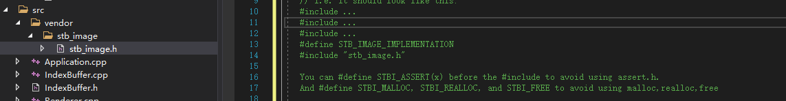

根据头文件编译

### 纹理如何安放

纹理相当于一种贴图的感觉，纹理也需要纹理坐标

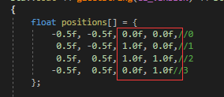

图里红框框就是纹理坐标，我们需要加载到GPU里，然后我们再加载一张图片，纹理坐标会根据图片进行采样，当然很明显有个问题就是，图片和我们要映射的区域很容易有差别，像素点也会有差别

比如我们的区域一个像素点刚好对应图片里四个像素点，是选择平均还是啥呢，选法不同，图片的效果也不一样。

纹理数据在Shader里的处理

这个**布局**需要格外注意一下，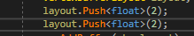

layout了两批数据，都是二维二维的，第一批为坐标，第二批为纹理坐标

m_elements结构体里有两组数据

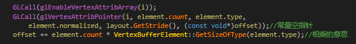

这两组数据是供glVertexAttribPointer使用的，很明显第一组坐标为0这个0要与shader里的location对应，第二组为1，

第一组的参数我说一下

glVertexAttribPointer(0, 2, GL_FLOAT, GL_FALSE, 4个字节, (const void*)0));//常量空指针

第二组的参数

glVertexAttribPointer(1, 2, GL_FLOAT, GL_FALSE, 4个字节, (const void*)2));

第二组相对于起始位置有2个偏移量

然后我们去Basic.shader里看，location与之对应，这样我们才取得到数据，

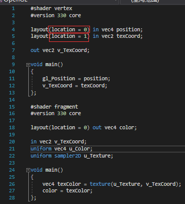

## Opengl的数学库

https://github.com/g-truc/glm

复制粘贴到这个目录下

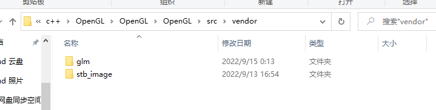

将该文件移除

因为里面也含有一个main()函数，这样我们就没法编译了

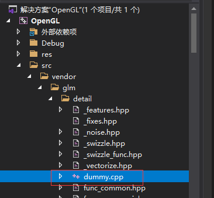

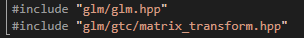


### 投影矩阵

一个正交投影矩阵的示范：

顶点矩阵

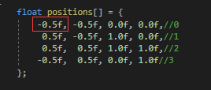

投影矩阵

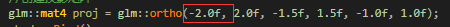

由于-0.5f是-2.0f的四分之一，所以会在整个屏幕的四分之一处，也就是所在窗口的四分之一处

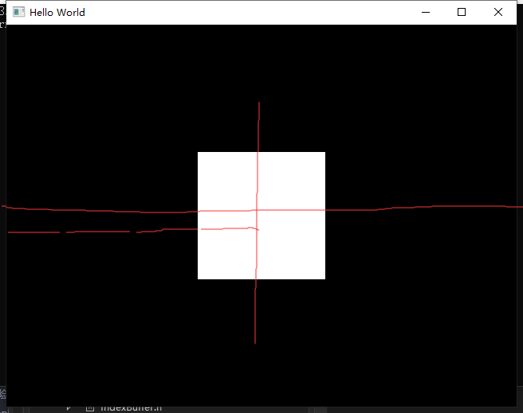

# VA(visual assist番茄助手的安装)

## 安装番茄助手（安装之前关闭VS2019)

## 复制CRACK里的VA_X.dll进入文件夹里


# 完整代码

#include <iostream>
#include <GL/glew.h>
#include <GLFW/glfw3.h>
#include <fstream>
#include <sstream>
#include <string>

#include "Renderer.h"

#include "VertexBuffer.h"
#include "IndexBuffer.h"
#include "VertexArray.h"
#include "Shader.h"

////想把这些一起都返回,用一个结构体返回
//struct ShaderProgramSource
//{
//    std::string VertexSource;
//    std::string FragmentSource;
//};
//
//
//static ShaderProgramSource ParseShader(const std::string& filepath)
//{
//    std::ifstream stream(filepath);
//
//    enum class ShaderType//用来取值的，好理解一点
//    {
//        NONE = -1, VERTEX = 0, FRAGMENT = 1
//    };
//
//
//
//    std::string line;
//    std::stringstream ss[2];//这个字符串流来保存两种不同的着色器
//    ShaderType type = ShaderType::NONE;//初始化用的，这是一个枚举class
//    while (getline(stream, line))//一行一行的读取数据
//    {
//        if (line.find("#shader") != std::string::npos)//这是在一行里面，找到了shader再看后面的
//        {
//            if (line.find("vertex") != std::string::npos)
//                type = ShaderType::VERTEX;//用int(type)
//            else if (line.find("fragment") != std::string::npos)
//                type = ShaderType::FRAGMENT;
//        }
//        else
//        {
//            ss[int(type)] << line << "\n";
//        }
//    }
//    return { ss[0].str(), ss[1].str() };
//}
//
//static unsigned int CompileShader(const std::string& source, unsigned int type)
//{
//    unsigned int id = glCreateShader(type);
//    const char* src = source.c_str();
//    //返回的是一个无终点的不可变数组，source就是我们传入的srting数组，等价于&source[0]
//    //不太懂，如果字符串已经超出了作用域，而你仍然持有这个实际的char指针，它会指向无用的内存
//    //并且这段代码不会起作用，所以要确保你的源字符串在你编译这段代码时仍然可用的。
//    glShaderSource(id, 1, &src, nullptr);
//    glCompileShader(id);
//    
//    int result;
//    glGetShaderiv(id, GL_COMPILE_STATUS,&result);
//    if (result == GL_FALSE)
//    {
//        int length;
//        glGetShaderiv(id, GL_INFO_LOG_LENGTH, &length);
//        char* message = (char*)alloca(length * sizeof(char));//动态分配一个消息char,并且是在堆里创建，会自己消失
//        glGetShaderInfoLog(id, length, &length, message);
//        std::cout << "Failed to compile"<<
//            (type == GL_VERTEX_SHADER ? "vertex" : "fragment") 
//            << std::endl;
//        std::cout << message << std::endl;
//        glDeleteShader(id);
//        return 0;
//    }
//
//
//    //return 的作用就是告诉我们错误的句柄
//    return id;
//}
//
//
//
//static unsigned int CreatShader(const std::string& vertexShader, const std::string& fragmentShader)
//{
//    unsigned int program = glCreateProgram();//unsigned int = GLuint
//    unsigned int vs = CompileShader(vertexShader, GL_VERTEX_SHADER);//创建了一个顶点着色器
//    unsigned int fs = CompileShader(fragmentShader, GL_FRAGMENT_SHADER);
//
//    glAttachShader(program, vs);//有两份不同的vs和fs绑在一起
//    glAttachShader(program, fs);
//    glLinkProgram(program);//链接到一起的作用
//    glValidateProgram(program);//在给定当前 OpenGL 状态的情况下检查其中包含的可执行文件是否可以执行
//
//    glDeleteShader(vs);//删除着色器，现在已经绑定在gl里了
//    glDeleteShader(fs);//删除着色器，现在已经绑定在gl里了
//
//    return program;
//}


int main()
{
    GLFWwindow* window;

    /* Initialize the library */
    if (!glfwInit())
        return -1;
    
    glfwWindowHint(GLFW_CONTEXT_VERSION_MAJOR, 3);
    glfwWindowHint(GLFW_CONTEXT_VERSION_MINOR, 3);
    glfwWindowHint(GLFW_OPENGL_PROFILE, GLFW_OPENGL_CORE_PROFILE);
    
    /* Create a windowed mode window and its OpenGL context */
    window = glfwCreateWindow(640, 480, "Hello World", NULL, NULL);
    if (!window)
    {
        glfwTerminate();
        return -1;
    }
    
    /* Make the window's context current */
    glfwMakeContextCurrent(window);
    
    glfwSwapInterval(1);//设置帧率使其垂直同步


    if (glewInit() != GLEW_OK)
    {
        std::cout << "glewInit err!" << std::endl;
    }
    std::cout << glGetString(GL_VERSION) << std::endl;
    {
        float positions[] = {
            -0.5f, -0.5f,//0
             0.5f, -0.5f,//1
             0.5f,  0.5f,//2
            -0.5f,  0.5f,//3
        };
    
        unsigned int indices[] =
        {
            0,1,2,
            2,3,0
        };
    
        //创建一个顶点数组并绑定
        //unsigned int vao;//vertex array object
        //GLCall(glGenVertexArrays(1, &vao));//创建一个顶点数组的缓冲区
        //GLCall(glBindVertexArray(vao));//绑定一个顶点数组的缓冲区
        VertexArray va;
    
        //将数据放入GPU
        //创建一个顶点缓冲区
        VertexBuffer vb(positions, sizeof(positions));
        VertexBufferLayout layout;
        layout.Push<float>(2);
        va.AddBuffer(vb, layout);


        //glEnableVertexAttribArray(0);
        //glVertexAttribPointer(0, 2, GL_FLOAT, GL_FALSE, sizeof(float) * 2, 0);
        //第一个是单一组件的索引，第二个是包含的组件数目
        //将数据放入GPU
    
        //将索引缓冲放入GPU
        IndexBuffer ib(indices, 6);
        //将索引缓冲放入GPU
        const std::string& filepath = "res/shaders/Basic.shader";
        Shader shader(filepath);//一放进去，构造函数就已经启用了
        shader.Bind();
        //shader.SetUniform4f("u_Color", r, 0.3f, 0.8f, 1.0f)
    
        //ShaderProgramSource source = ParseShader("res/shaders/Basic.shader");//读取字符串
        ////std:: cout << "VERTEX" << std::endl;
        ////std::cout << source.VertexSource << std::endl; 
        ////std::cout << "FRAGMENT" << std::endl;
        ////std::cout << source.FragmentSource << std::endl;
        //unsigned int shader = CreatShader(source.VertexSource, source.FragmentSource);
        //glUseProgram(shader);
    
        //解绑
        va.Unbind();
        shader.Unbind();
        ib.Unbind();
        vb.Unbind();
        //GLCall(glBindVertexArray(0));
        //GLCall(glUseProgram(0));
        //GLCall(glBindBuffer(GL_ARRAY_BUFFER, 0));
        //GLCall(glBindBuffer(GL_ELEMENT_ARRAY_BUFFER, 0));
    
        //GLCall(int location = glGetUniformLocation(shader, "u_Color"));
        //ASSERT(location != -1);//等于-1就会形成断点，也就是没找到u_Color


        float r = 0.0f;
        float increment = 0.05f;
        /* Loop until the user closes the window */
        while (!glfwWindowShouldClose(window))
        {
            /* Render here */
            glClear(GL_COLOR_BUFFER_BIT);
            //glDrawArrays(GL_TRIANGLES, 0, 6);
                //先清楚所有错误
     /*       GLClearError();*/
            //重新绑定
            //GLCall(glUseProgram(shader));//绑定着色器
            //GLCall(glUniform4f(location, r, 0.3f, 0.8f, 1.0f));//设置统一变量
            //GLCall(glBindVertexArray(vao));//绑定顶点数组
            //GLCall(glBindBuffer(GL_ARRAY_BUFFER, buffer));
            shader.Bind();
            va.Bind();
            ib.Bind();//绑定顶点缓冲区
            //glEnableVertexAttribArray(0);//
            //glVertexAttribPointer(0, 2, GL_FLOAT, GL_FALSE, sizeof(float) * 2, 0);//设置顶点缓冲区的布局
    
            //GLCall(glBindBuffer(GL_ELEMENT_ARRAY_BUFFER, ibo));//绑定索引缓冲区


                //再去检查错误就可以保证所有错误都由这个函数导致的
            //ASSERT(GLLogCall());
            //指定当前绑定到 GL_ELEMENT_ARRAY_BUFFER 目标的缓冲区的数据存储中数组中第一个索引的偏移量。
            //已经绑定了，所以可以写
    
            //使颜色开始变换
            /*GLCall(glUniform4f(location, r, 0.3f, 0.8f, 1.0f));*/
            shader.SetUniform4f("u_Color", r, 0.3f, 0.8f, 1.0f);
            GLCall(glDrawElements(GL_TRIANGLES, 6, GL_UNSIGNED_INT, nullptr));//画六个点，指定类型
            if (r > 1.0f)
            {
                increment = -0.05f;
            }
            else if (r < 0.0f)
            {
                increment = 0.05f;
            }
            r += increment;
            /* Swap front and back buffers */
            glfwSwapBuffers(window);
    
            /* Poll for and process events */
            glfwPollEvents();
        }
    }
    glfwTerminate();
    return 0;
}
